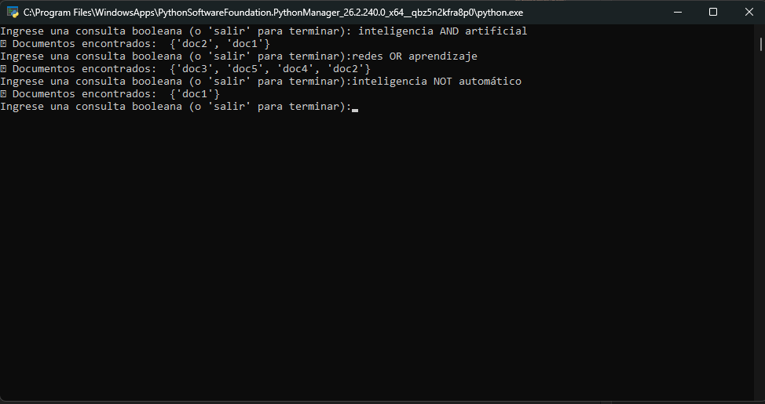

# 🔍 Motor de Búsqueda Booleana con NLTK

Este proyecto implementa un sistema de **Recuperación de Información (IR)** basado en el **Modelo de Búsqueda Booleana** e **Índice Invertido**. Utiliza la biblioteca **NLTK (Natural Language Toolkit)** para el preprocesamiento de textos en español.

---

## 📌 Características principales

- **Preprocesamiento de texto NLP**:
  - Convertidor de texto a minúsculas (*Lowercasing*).
  - Tokenización mediante `word_tokenize`.
  - Filtrado de palabras vacías (*Stopwords*) en español.
  - Eliminación de signos de puntuación y caracteres especiales.
- **Índice Invertido**: Mapeo eficiente de cada palabra procesada hacia los identificadores de los documentos en los que aparece.
- **Consultas Booleanas**: Soporte para los operadores `AND`, `OR` y `NOT` mediante operaciones algebraicas de conjuntos (intersección, unión y diferencia).
- **Consola Interactiva**: Interfaz de línea de comandos en tiempo real para ingresar búsquedas continuas.

---

## 🛠️ Requisitos e Instalación

### Requisitos previos

- Python 3.8 o superior.
- Biblioteca `nltk`.

### Instalación de dependencias

1. Clona o descarga este repositorio.
2. Instala las dependencias necesarias:

```bash
pip install nltk
```

3. (Opcional) Si ejecutas los scripts por primera vez, desintercala los comentarios para descargar las colecciones de datos necesarias de NLTK:

```python
import nltk
nltk.download('punkt')
nltk.download('stopwords')
```

---

## 📁 Archivos del Repositorio

- `Consigna1_Claves.py`: Script principal interactivo que permite ingresar consultas libremente a través de la terminal hasta ingresar `salir`.
- `ejemploClavesBoleanas.py`: Script de prueba automatizado con consultas prefijadas para validar la precisión del índice invertido.

---

## 🚀 Uso del Proyecto

### Búsqueda Interactiva

Para ejecutar el programa con entrada del usuario:

```bash
python Consigna1_Claves.py
```

Al iniciarse, podrás ingresar consultas en la terminal.

#### Ejemplos de uso e interpretación de resultados:

| Consulta | Operación realizada | Resultado esperado |
| :--- | :--- | :--- |
| `inteligencia AND artificial` | Devuelve los documentos que contienen **ambos** términos. | `{'doc1', 'doc2'}` |
| `redes OR aprendizaje` | Devuelve los documentos que contienen **al menos uno** de los términos. | `{'doc2', 'doc3', 'doc4', 'doc5'}` |
| `inteligencia NOT automático` | Devuelve los documentos con `inteligencia` pero **excluye** los que tienen `automático`. | `{'doc1'}` |

Para finalizar la ejecución en consola, escribe `salir`.

---

## ⚙️ ¿Cómo funciona internamente?

1. **Preprocesamiento (`preprocess`)**:
   $$T \xrightarrow{\text{lower()}} T' \xrightarrow{\text{tokenize}} \{\text{tokens}\} \xrightarrow{\text{filtro stops \& alnum}} \{\text{palabras clave}\}$$
2. **Construcción del Índice Invertido**:
   Mapea cada palabra clave a una lista/conjunto de IDs de documentos:
   $$\text{índice}[\text{"inteligencia"}] = \{\text{"doc1"}, \text{"doc2"}, \text{"doc5"}\}$$
3. **Evaluación de la Consulta Booleana**:
   Se procesa la cadena de consulta token a token aplicando teoría de conjuntos:
   - `AND` $\rightarrow \text{Intersección } (\cap)$
   - `OR` $\rightarrow \text{Unión } (\cup)$
   - `NOT` $\rightarrow \text{Diferencia } (\setminus)$

---

## 📷 Captura de Pantalla

Ejemplo de ejecución en consola (`Consigna1_Claves.py`):


